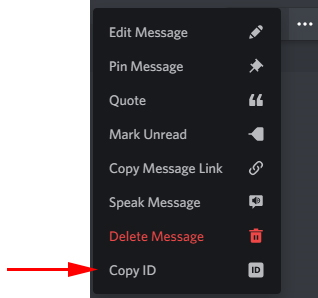

# Rule Reaction System

Pootis-Bot comes with a rule reaction system.

Setting it up can take a little bit, but helps to stop a lot of spam and bots.

## What is a 'Rule Reaction System'?

It sort of hard to explain in words, but a 'rule reaction system' is when a new user joins your Discord server and has to react to a message with a certain emoji first to gain access to the rest of the Discord server.

## Setup

How to setup the 'rule reaction system' in Pootis-Bot.

### Message

First off, you need a message. This message could be anywhere, but you should put it in a channel by itself (E.G: A `#rules` channel). 

#### The channel were the message will be

The channel where you put the message is also important, it requires the **@everyone** role to be able to read the message(duh), see message history, and to be able to react in the channel as well. The bot’s role also needs the ‘Add Reactions’ permission.

#### Getting the message ID

Now you need to get the message ID. Follow [this guide](https://support.discordapp.com/hc/en-us/articles/206346498-Where-can-I-find-my-User-Server-Message-ID-) to learn how get into developer mode.

Once in developer mode on Discord, hover over the message you want to get the ID of, then next to were you would react to a message, click on on the three little dots **->** Copy ID.



Here is the menu of how to get the message ID.

#### Setting the message ID

Once you have copied the ID of the message you want users to react to, run the command:

```bash
setup set rulemessage [ID]
```

But instead of `[ID]` you would put the ID of the message we copied before.

So like:

```bash
setup set rulemessage 487951616666763274
```

You will also get a response message when you run this command, if you want to silence the response you can do:

```bash
setup set rulemessage [ID] true
```

### Emoji

Now it is time to choose an emoji for people to react to.

#### Choosing an emoji

To choose an emoji, go to [this site](https://unicode.org/emoji/charts/full-emoji-list.html) and pick out an emoji. For this example I will choose 😄(grinning face with smiling eyes).

#### Setting the emoji

To set the emoji, run the command:

```bash
setup set ruleemoji [emoji]
```

So for our example, you would do:

```bash
setup set ruleemoji 😄
```

!!! warning
    The emoji **CANNOT** be the one in the Discord format, it must be an unicode!
    😄 would actually be `:simle:` in Discord but due to way the bot works `:simle:` won't work!

    The bot does check for this and will tell you!

It is all so a good idea to put in that message that you need to react to this message with this emoji.

E.G: `React with 😄 to gain access to the server once you have read the rules!`

### Role

The second last thing is to set up a role. This role should be your *base* role.

Create a new role like normal, but make it like a generic role. A standard role for new users.

Give it permissions to access the channels that people who have reacted to the message can access.

Once you have done that change the @everyone role to only have access to the channel that the message is contained in and that they can react to the message.

This example, the *base* role will be called `Member`

Once you have your role done, run the command:

```bash
setup set rulerole [role]
```

So for our example it would be:

```bash
setup set rulerole Member
```

### Enabling / Disabling rule reaction

To enable the rule reaction feature, you **MUST** have done all the previous steps, after that, run the command:

```bash
setup toggle rulereaction
```

If you want to disable this feature just re-run the same command again and it will be disabled!

### Done!

Assuming everything is correct it all should work. If a new user joins that should only have access to the channels that you specified until they react on that message with that specific emoji.

So for our example, it should be *John Smith* joins the Discord server, can only see the **#rules** channel, until he has reacted on a message in the **#rules** channel with the 😄 emoji.